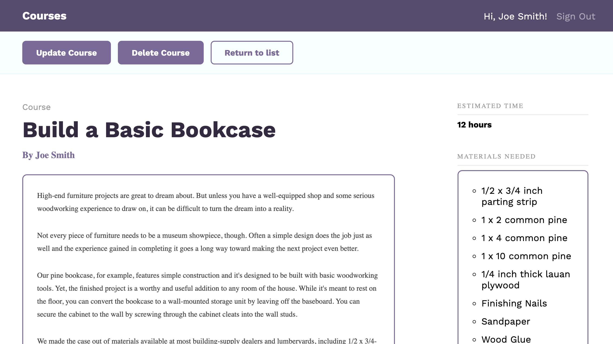

# React & RestAPI App

> built with Express, Nodejs and Sequelize

[](https://www.npmjs.com/) [](https://github.com/brandonwie) [](https://github.com/brandonwie)

## Courses Library DB App

## Settings

- [React](https://reactjs.org/)
- [Node.js](https://nodejs.org/en/)
- Server Framework: [Express](https://expressjs.com/)
- ORM: [Sequelize](https://sequelize.org/) - promise-based Node.js ORM
  - setup with [Sequelize CLI](https://github.com/sequelize/cli)
- SQL Database Engine: [SQLite](https://www.sqlite.org/)

## Installation

Mac OS:
Install in `/api` and `/client` folders

```bash
npm install
npm start
```

## Skills

- JavaScript
- React
- NodeJS; Express, js-cookie, bcryptjs
- SQL Database Engine: SQLite
- ORM: Sequelize(Node.js ORM)

## Screenshots





